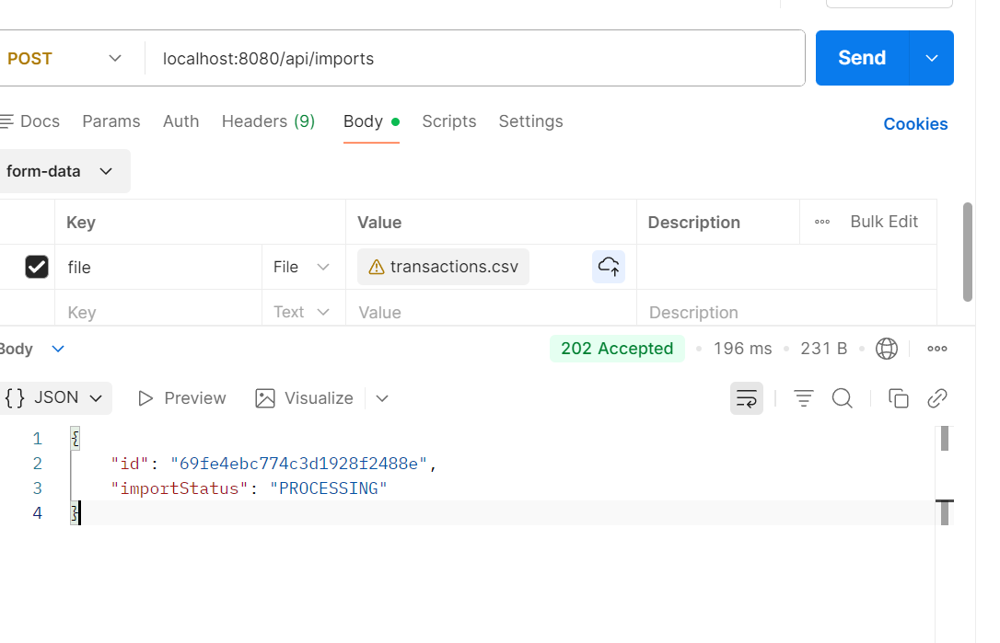
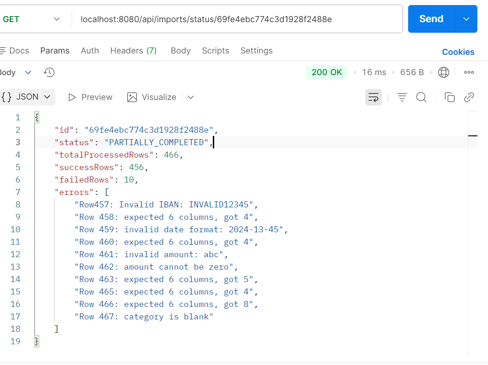
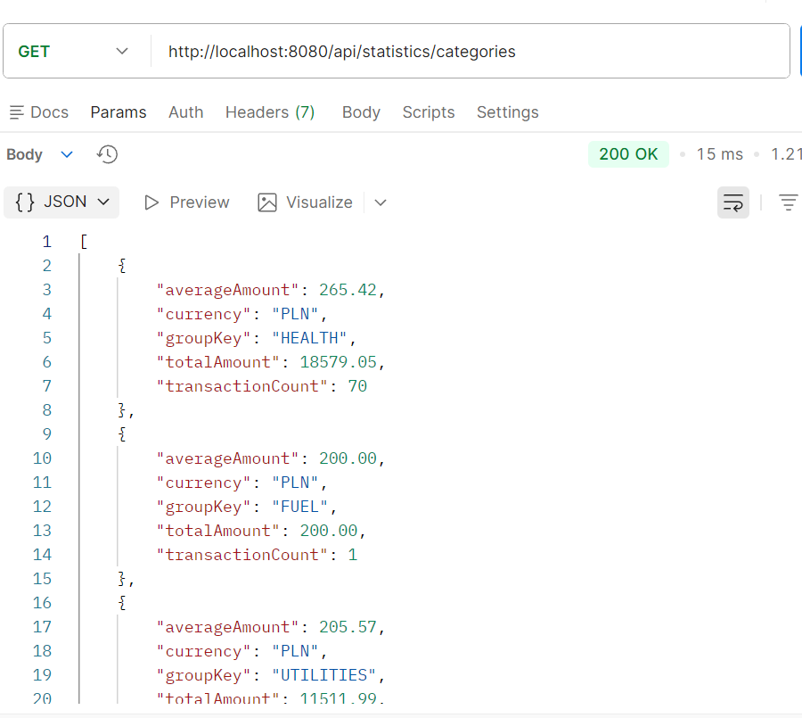
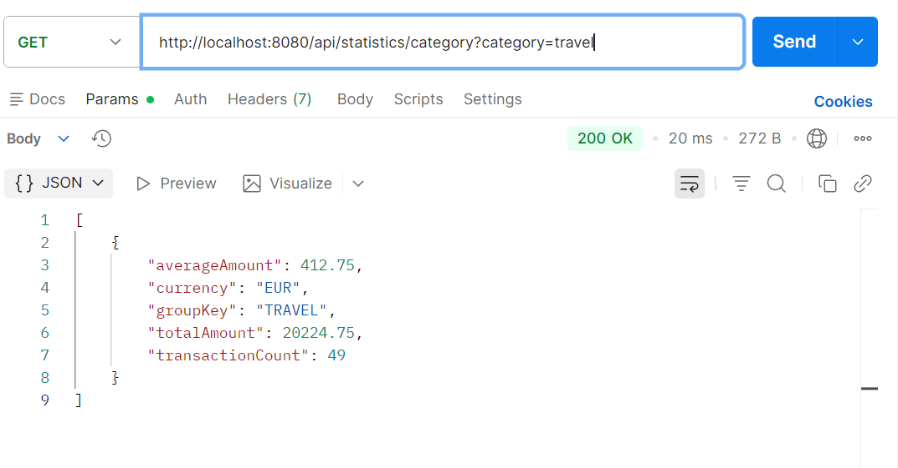
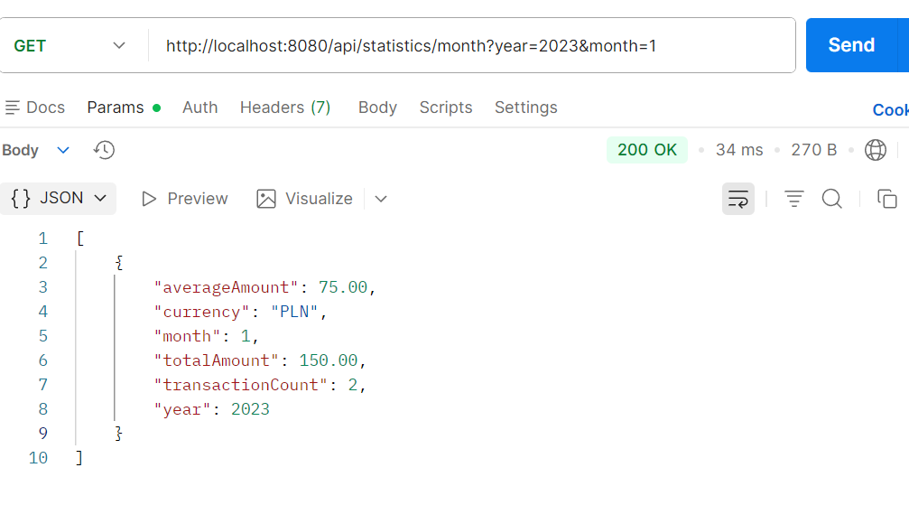

# Transactions Importer

A Spring Boot application for importing financial transactions from CSV files and generating statistics.

## Features

- **Asynchronous CSV Import**: Process large CSV files in the background.
- **Progress Tracking**: Monitor the status of import jobs, including success/failure counts and error details.
- **Row Validation**: Ensures imported transactions have valid structure and values.
- **Statistics API**:
    - Aggregate statistics by category.
    - Show statistic for all categories.
    - Monthly transaction summaries.
    - IBAN-specific statistics.
- **Robust Error Handling**: Detailed validation and comprehensive exception mapping.

## Technologies

- **Java 17**
- **Spring Boot 4.0.6**
- **Spring Data MongoDB**
- **MongoDB 7.0**
- **Lombok**
- **OpenCSV** (for parsing)
- **iban4j** (for IBAN validation)
- **JUnit 5 / Mockito / Awaitility** (for testing)

## Prerequisites

- **JDK 17** or higher
- **Docker** and **Docker Compose**

## Getting Started

### 1. Clone the repository
```bash
git clone <repository-url>
cd transactions-importer
```

### 2. Start MongoDB
The application requires a running MongoDB instance. You can start one using the provided `docker-compose.yml`:
```bash
docker compose up -d
```

### 3. Run the application
Use Gradle to start the Spring Boot application:
```bash
./gradlew bootRun
```
The server will start at `http://localhost:8080`.

### 4. Health Check
You can verify that the application is running by checking the health endpoint:
- **Endpoint**: `GET http://localhost:8080/actuator/health`
- **Expected Response**:
```json
{
    "status": "UP",
    "groups": [
        "liveness",
        "readiness"
    ]
}
```

## API Documentation

### Import API

#### Upload CSV
- **Endpoint**: `POST /api/imports`
- **Content-Type**: `multipart/form-data`
- **Body**: `file` (CSV file)
- **Response**: `202 Accepted`
```json
{
  "id": "69fe44ff17ad5ec030fcacd4",
  "importStatus": "PROCESSING"
}
```

#### Check Import Status
- **Endpoint**: `GET /api/imports/status/{id}`
- **Response**: `200 OK`
```json
{
  "id": "69fe44ff17ad5ec030fcacd4",
  "status": "PARTIALLY_COMPLETED",
  "totalProcessedRows": 466,
  "successRows": 456,
  "failedRows": 10,
  "errors": [
    "Row457: Invalid IBAN: INVALID12345",
    "Row 458: expected 6 columns, got 4",
    "Row 459: invalid date format: 2024-13-45",
    "Row 460: expected 6 columns, got 4",
    "Row 461: invalid amount: abc",
    "Row 462: amount cannot be zero",
    "Row 463: expected 6 columns, got 5",
    "Row 465: expected 6 columns, got 4",
    "Row 466: expected 6 columns, got 8",
    "Row 467: category is blank"
  ]
}
```

### Statistics API

#### Get All Categories
- **Endpoint**: `GET /api/statistics/categories`
- **Response**: List of category statistics.

#### Get Statistics by Category
- **Endpoint**: `GET /api/statistics/category?category=food`
- - **Response**: `200 OK`
```json
[
  {
    "averageAmount": 97.89,
    "currency": "PLN",
    "groupKey": "FOOD",
    "totalAmount": 10572.13,
    "transactionCount": 108
  }
]

```

#### Get Monthly Statistics
- **Endpoint**: `GET /api/statistics/month?year=2023&month=1`
- - **Response**: `200 OK`
```json
[
    {
        "averageAmount": 236.72,
        "currency": "PLN",
        "month": 1,
        "totalAmount": 49948.12,
        "transactionCount": 211,
        "year": 2023
    },
    {
        "averageAmount": 339.17,
        "currency": "EUR",
        "month": 1,
        "totalAmount": 7122.50,
        "transactionCount": 21,
        "year": 2023
    }
]

```

#### Get Statistics by IBAN
- **Endpoint**: `GET /api/statistics/iban?iban=DE...`

## Supported Currencies

The application currently supports the following currencies:
- **PLN** (Polish Zloty)
- **EUR** (Euro)
- **USD** (US Dollar)
- **GBP** (British Pound)
- **CHF** (Swiss Franc)

## Testing

Run all unit and integration tests:
```bash
./gradlew test
```

## CSV Format

The CSV file should contain a header row and follow this structure:
`IBAN,Title,Date,Currency,Category,Amount`

A sample CSV file that can be used for testing is located at: `sample-data/transactions.csv`.

Example:
```csv
IBAN,Title,Date,Currency,Category,Amount
DE89370400440532013000,Salary,2023-01-01,PLN,WORK,5000.00
```

## Evidence of Working Application

Below there are some screenshots from Postman proving that the application is working correctly:










